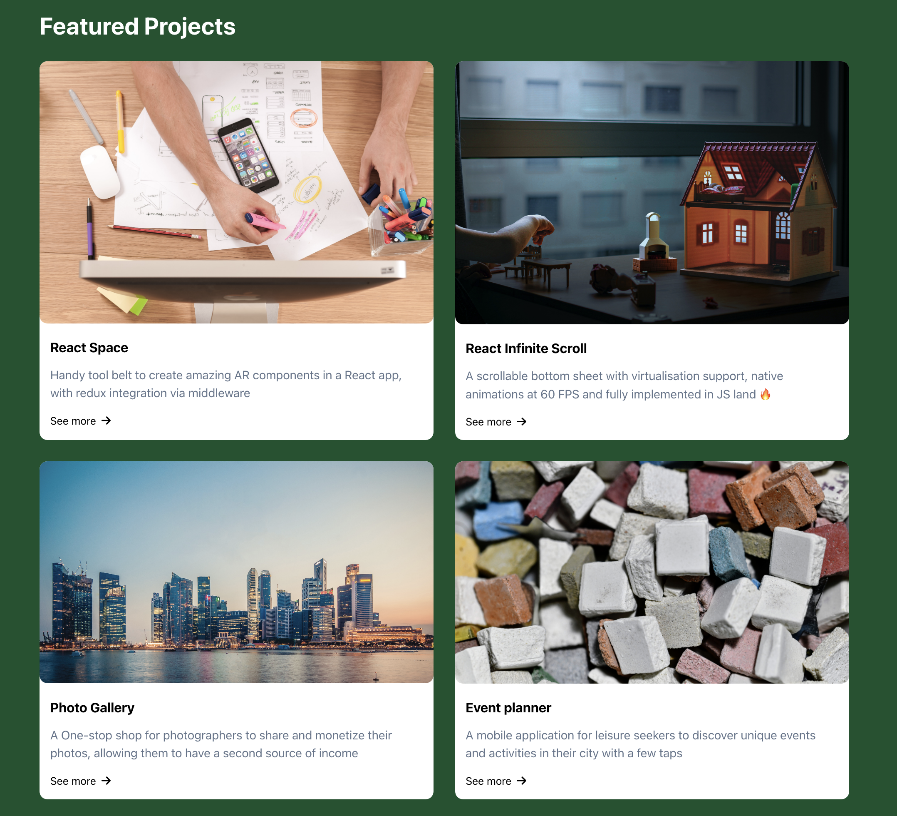

# Advanced-React-Portfolio
A front-end developer portfolio that specializes and is powered in React. 

# Introduction
This is my portfolio as a front-end developer that is built with React to demonstrate my skills. It is a single-page application that showcases my work and contains the following sections:

- A header with external links to social media accounts and internal links to other sections of the page
- A landing section with an avatar picture and a short bio
- A section to display some featured projects (NOT REAL) as cards in a grid fashion
- A contact me section with a form to allow visitors to contact me

## Prerequisite Installation
To run and host the app, make sure Node.js, and NPM are installed on your local device and simply run `npm build` to install all the necessary packages for serving the app. Ensure the terminal is pointing to the root directory of the project folder as its target directory. `npm start` when all the packages are installed properly.

## Libraries
The React application is built with some popular external open-source libraries that provide extensive help to me to create a more polished and professional-looking page in a more effective approach.

### Chakra UI
Chakra UI is a simple, modular, and accessible component library that provides me with the building blocks needed for your React applications. 

Chakra groups its different components by categories, like layout, forms, data display, feedback, typography, or overlay. Some of its components are implemented in the application.

### Formik and Yup
There is a (Contact Me) form in the application to showcase some fundamental business logic when submitting a form. Its UI is entirely implemented with Chakra UI components while the underlying logic and functionalities are built with the help of Formik and Yup in conjunction.

Formik is another popular open-source library that helps to create forms in React. The library takes care of the repetitive tasks of managing the state of the form, validation, and submission, so I can focus on the business logic of the application. It does so by providing a set of components and hooks that you can plug into your forms.

Yup is a JavaScript open-source library used to validate the form data before submitting it to the server. It provides a set of chainable operators that can be hooked into the form fields to declaratively specify the validation rules which provides ease in validating forms.

Formik comes with built-in support for schema-based form-level validation through Yup, so they work together seamlessly.

### Simple Snapshot
#### **Landing Section**

#### **Projects Section**

#### **Contact Me Section**

